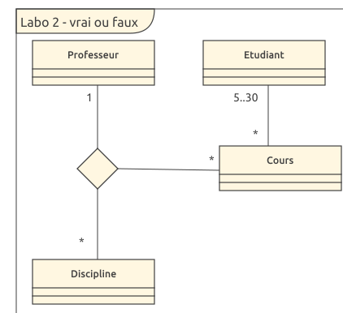

# Diagramme de classe

## Vrai ou faux

Etant donné le diagramme de domaine ci-dessus, les assertions suivantes sont-elles vraies ou fausses ? 
- Etudiant est une classe d’association -> faux, c'est une classe conceptuelle
- Un étudiant peut participer à autant de cours qu’il veut -> vrai, la cardinalité est "*"
- Plusieurs professeurs peuvent enseigner la même discipline -> faux, la cardinalité est de "1"
- Un professeur peut enseigner plusieurs disciplines -> vrai, la cardinalité est "*"
- Un cours peut être enseigner à 2 étudiants -> faux, il en faut minimimum 5
- Un cours peut être enseigner à 20 étudiants -> vrai

## Question ouverte

Représentez la même association avec la notation UML « petit losange »

- Quelles informations perd-on par rapport au diagramme ci-dessus ? 
On perd l'information que la relation principale est entre professeur et discipline et qu'à cette relation, on vient ajouter une information qui est le cours.
